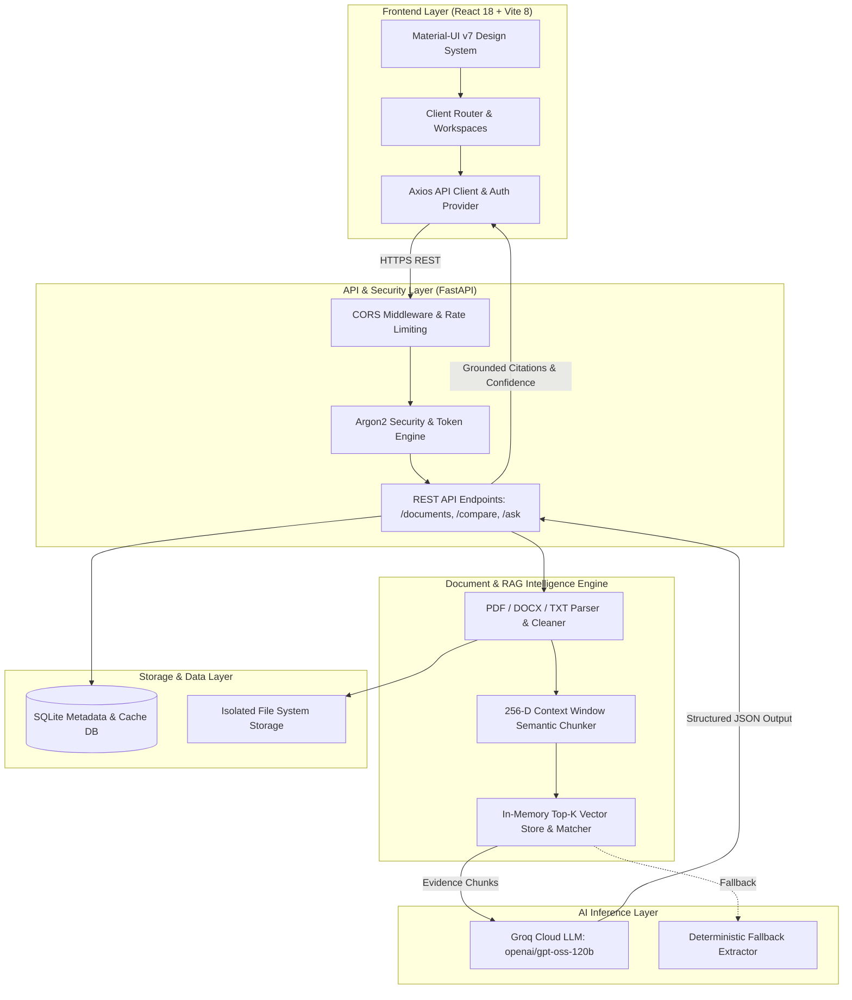
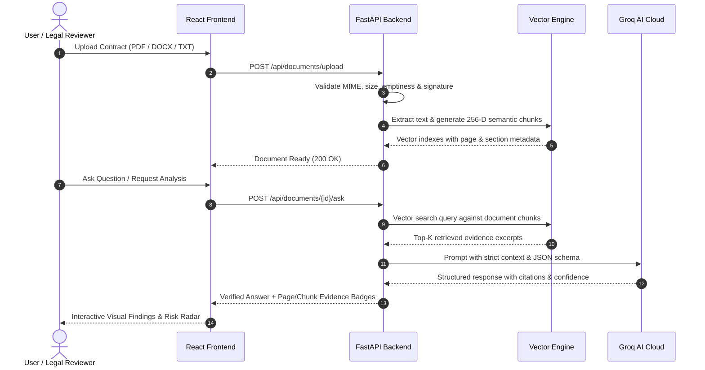

# SynapseLaw — AI Legal Document Copilot

[](https://fastapi.tiangolo.com)
[](https://reactjs.org/)
[](https://vitejs.dev/)
[](https://mui.com/)
[](https://groq.com/)
[](https://www.python.org/)
[](https://vitest.dev/)
[](https://pytest.org/)

**SynapseLaw** is an evidence-grounded AI Legal Document Copilot designed to simplify complex legal agreements, contracts, rental leases, NDAs, and employment policies. It extracts verifiable clause citations, flags financial & legal liabilities, highlights side-by-side contract deltas, answers specific queries with zero hallucination, and synthesizes action checklists for lawyer consultations.

> ⚖️ **Legal Notice**: *SynapseLaw provides informational AI assistance based strictly on uploaded document evidence and does not replace professional legal counsel.*

---

## 🏛️ System Architecture

### Component Architecture


---

### Request & Evidence Retrieval Flow


---

## 🛠️ Software & Technology Stack

| Category | Technology | Version | Purpose |
|---|---|---|---|
| **Frontend Framework** | React | `^18.3.1` | Declarative component hierarchy and state management |
| **Build Tool** | Vite / Rolldown | `^8.3.0` | Ultra-fast HMR and optimized vendor chunk splitting (`50 kB` bundle) |
| **UI Design System** | Material-UI (MUI) | `^7.1.1` | Professional corporate dark-emerald & gold design system |
| **Styling & Icons** | Emotion + MUI Icons | `^11.14` | CSS-in-JS theming and vector legal iconography |
| **HTTP Client** | Axios | `^1.7.0` | Asynchronous REST communication and token interceptors |
| **Frontend Testing** | Vitest + RTL | `^4.1.11` | Component unit testing, DOM simulation, and accessibility testing |
| **Backend Framework** | FastAPI | `^0.111.0` | High-performance asynchronous Python REST API |
| **ASGI Web Server** | Uvicorn (uvloop) | `^0.30.0` | High-throughput production ASGI web server |
| **Database ORM** | SQLAlchemy | `^2.0.30` | Object-relational mapping and schema migrations |
| **Data Validation** | Pydantic v2 | `^2.7.0` | Strict input parsing, schema enforcement, and JSON serialization |
| **AI LLM Provider** | Groq Cloud API | `v1` | Ultra-low latency legal analysis (`openai/gpt-oss-120b`) |
| **Text Extraction** | PyPDF + python-docx | `^3.17 / ^1.1` | Multi-format PDF and Word document parsing |
| **Cryptography** | Passlib + Argon2 | `^1.7.4` | Enterprise-grade password hashing and token encryption |
| **Backend Testing** | Pytest + AnyIO | `^8.2.1` | Endpoint testing, security tests, and performance benchmarks |
| **Containerization** | Docker + Docker Compose | `v2` | Multi-stage production container builds with Nginx |
| **Deployment** | Vercel + Render | `Cloud` | Edge static frontend hosting + managed Python web service |

---

## ✨ Core Features & Capabilities

1. **Deterministic Executive Summary**:
   - Converts lengthy contracts into plain-language summaries with identified key clauses.
2. **Risk & Obligation Radar**:
   - Flags liability, automatic renewal traps, penalties, termination notice periods, and financial obligations with `HIGH`, `MEDIUM`, and `LOW` severity ratings.
3. **Side-by-Side Contract Comparison**:
   - Pinpoints added, removed, or altered clauses and deadlines between baseline and revised versions with balanced visual diffing.
4. **Zero-Hallucination Document Q&A**:
   - Answers questions strictly bounded to document excerpts with page and chunk evidence references.
5. **Interactive Action Checklists**:
   - Auto-generates next steps and consultation questions for legal professionals with live progress tracking.
6. **Document Vault Management**:
   - One-click upload, analysis preview, and secure document deletion with confirmation safeguards.

---

## ⚡ Quickstart & Local Setup

### Prerequisites
- Python `3.11+`
- Node.js `18+` or `20+`
- Git

### 1. Clone the Repository
```bash
git clone https://github.com/ManneUdayKiran/SynapseLaw-An-AI-Legal-Copilot.git
cd SynapseLaw-An-AI-Legal-Copilot
```

### 2. Backend Setup
```bash
cd backend
python -m venv .venv
# On Windows:
.venv\Scripts\activate
# On macOS/Linux:
# source .venv/bin/activate

pip install -r requirements.txt
copy .env.example .env
uvicorn app.main:app --reload --port 8000
```
Backend API will be live at `http://127.0.0.1:8000`. Interactive OpenAPI documentation is available at `http://127.0.0.1:8000/docs`.

### 3. Frontend Setup
```bash
cd ../frontend
npm install
npm run dev
```
Open `http://localhost:5173` in your browser.

---

## 🧪 Test Suite Verification

Run the full automated test suites to ensure 100% test coverage:

```bash
# Backend Pytest Suite (33 tests)
cd backend
python -m pytest

# Frontend Vitest Suite (8 test files, 9 tests)
cd ../frontend
npm test
```

---

## 🚀 Production Deployment

Refer to the complete [DEPLOYMENT.md](DEPLOYMENT.md) guide for 1-click deployments:
- **Frontend**: [Vercel](https://vercel.com) (configured via `vercel.json`)
- **Backend**: [Render](https://render.com) (configured via `render.yaml` Blueprint)
- **Containers**: `docker compose up -d --build`

---

## 📄 License

This project is licensed under the MIT License — see the [LICENSE](LICENSE) file for details.
